# 亚马逊电商营销系统 - 业务框架图

> 版本：v0.3（草稿 · 新增 营销工具站）
> 适用：公司内部全员共识与宣讲
> 配套文档：[《产品到营销系统-产品规划》](./产品到营销系统-产品规划.md)

---

## 一、系统定位

**一句话定位**：面向亚马逊电商业务的「产品→营销」一体化智能中台，打通选品调研、内容生产、营销执行、数据洞察全链路，让公司的营销动作**可复用、可衡量、可优化**。

**三个关键词**：
- **全链路**：从产品上新到复盘迭代，覆盖所有营销动作
- **多渠道一体**：亚马逊站内（广告/活动/Listing）+ 站外（红人/社媒/Google/**GEO**/EDM）+ **自建站**（独立站/私域）
- **数据驱动**：每个营销决策都有数据支撑，每次执行都沉淀数据资产

**v0.2 新增**：
- **智能客服中心**（独立为第 6 大中心）：AI 驱动的买家服务体系
- **自建站运营中心**（独立为第 7 大中心）：独立站搭建与私域运营
- **GEO**（生成式引擎优化）：作为重点子模块，分布在"内容生产"与"站外引流"中心

**v0.3 新增**：
- 🆕 **营销工具站**：瑞士军刀式提效工具集（生图 / 图片审核 / Listing 校验 / FBA 计算器 等 20+ 小工具），嵌入到所有业务流程中。**注意：与七大业务中心定位不同**——业务中心是端到端工作流，工具站是碎片化提效工具集。

---

## 二、业务框架总览图（六层架构）

```mermaid
flowchart TB
    subgraph L1["① 业务目标层"]
        G1["GMV 增长"]
        G2["ROI 提升"]
        G3["品牌沉淀"]
        G4["效率提升"]
    end

    subgraph L2["② 使用角色层"]
        R1["选品经理"]
        R2["Listing 运营"]
        R3["广告投手"]
        R4["站外 / 红人运营"]
        R5["文案 / 美工"]
        R6["客服"]
        R9["独立站运营 🆕"]
        R7["数据分析师"]
        R8["主管 / 总监"]
    end

    subgraph L3["③ 业务场景层（核心营销动作）"]
        S1["选品调研"]
        S2["Listing 搭建"]
        S3["首发推广"]
        S4["日常运营"]
        S5["活动促销"]
        S6["评论管理"]
        S7["数据复盘"]
    end

    subgraph L4["④ 七大业务中心 + 营销工具站（产品模块）"]
        M1["内容生产中心"]
        M2["数据资产中心"]
        M3["营销执行中心"]
        M4["站外引流中心<br/>（含 GEO）"]
        M6["智能客服中心"]
        M7["自建站运营中心"]
        M5["洞察决策中心"]
        M8["🧰 营销工具站 🆕<br/>（嵌入式工具集）"]
    end

    subgraph L5["⑤ 能力支撑层"]
        C1["AI 大模型"]
        C2["数据采集引擎"]
        C3["标签 / 分类体系"]
        C4["品牌 / 产品知识库"]
        C5["权限 / 审批流"]
    end

    subgraph L6["⑥ 数据源 / 基础设施层"]
        D1["亚马逊 SP-API"]
        D2["亚马逊 Ads API"]
        D3["站外平台 API<br/>(Google/Meta/TikTok)"]
        D4["第三方数据<br/>(卖家精灵/H10)"]
        D5["内部系统<br/>(ERP/WMS/CRM)"]
    end

    L1 --> L2 --> L3 --> L4 --> L5 --> L6
```

**如何阅读这张图**：
- **自上而下**：业务目标由谁来做（角色）→ 通过哪些动作做（场景）→ 用哪些系统模块做（中心）→ 靠什么能力支撑 → 数据从哪来
- **自下而上**：数据沉淀为资产 → 能力层加工 → 模块层赋能 → 支撑业务动作 → 服务角色 → 达成目标

---

## 三、核心业务流：产品 → 营销全链路

**这是一条贯穿所有角色和模块的主流程**，也是营销系统要服务的核心链路。

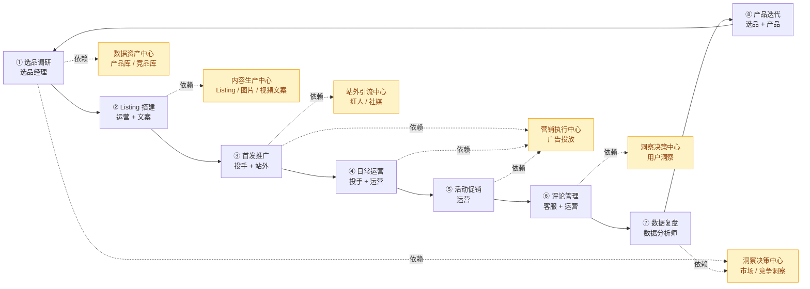

**关键说明**：
- 业务流是**闭环**：复盘结果回流到选品和产品迭代，形成数据飞轮
- 每个环节都**强依赖**五大中心之一，系统能力落地到具体业务动作

---

## 四、七大业务中心详解

### 4.1 内容生产中心（对应 V1.0）

**定位**：AI 驱动的营销内容工厂，覆盖亚马逊业务全场景文案需求。

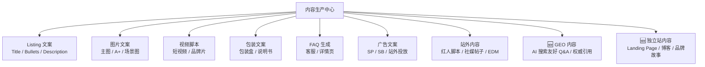

**核心价值**：内容产出效率提升 3-5 倍，品牌调性标准化，覆盖 AI 搜索与私域新阵地。

---

### 4.2 数据资产中心（对应 V2.0）

**定位**：公司级产品与营销数据的统一底座，消除信息孤岛。

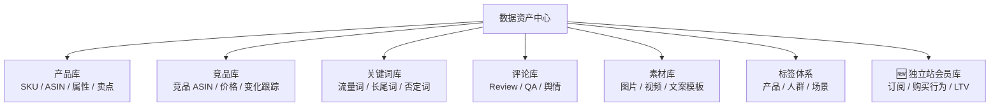

**核心价值**：建立公司级数据资产，打通站内外用户数据，为智能分析提供燃料。

---

### 4.3 营销执行中心（新增，当前缺失）

**定位**：亚马逊站内营销动作的统一操作台，广告+活动+Listing 管理一体化。

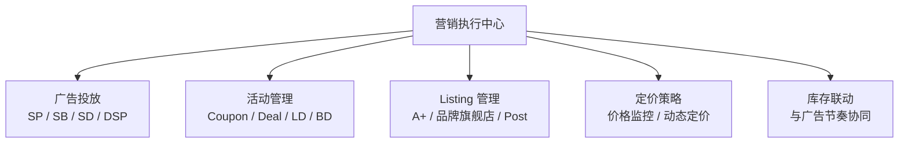

**核心价值**：一站式执行，替代多个后台间反复切换，动作可记录可复盘。

---

### 4.4 站外引流中心（新增，当前缺失）

**定位**：整合亚马逊站外的流量渠道，为站内 Listing 导流，同时沉淀品牌。

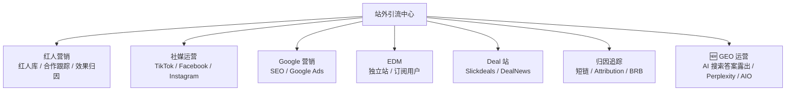

**核心价值**：突破亚马逊站内流量天花板，获取增量流量并沉淀品牌；抢占 AI 搜索时代的新流量入口。

> **GEO 是什么**：Generative Engine Optimization（生成式引擎优化）。当用户在 ChatGPT / Perplexity / Google AI Overview 中提问"best XXX 2026"时，我们的品牌和产品能被 AI 引用作为答案的一部分。GEO 是继 SEO 之后最重要的流量获取方式变革，需要的不再是关键词堆砌，而是**结构化 Q&A、权威引用、实体标注**。

---

### 4.5 智能客服中心（V2.0 新增 🆕）

**定位**：AI 驱动的买家服务体系，把客服从"成本中心"转化为"增长中心"。

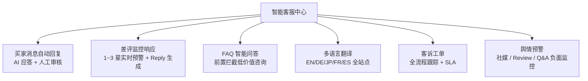

**核心价值**：
- 客服效率提升 5 倍，减少 50% 客服人力
- 差评平均响应时长从 24h 降至 1h
- 客服质量直接影响评分（搜索排名）、复购（LTV）、品牌口碑

**为什么单独成中心**：在亚马逊运营里，客服是"临门一脚"——影响搜索排名、影响复购、影响差评危机。在 AI 时代，智能客服已从"成本控制工具"变成"品牌增长引擎"，值得作为独立中心投入。

---

### 4.6 自建站运营中心（V2.0 新增 🆕）

**定位**：独立站（Shopify / Shoplazza / 自研）搭建与运营，沉淀品牌与私域用户资产。

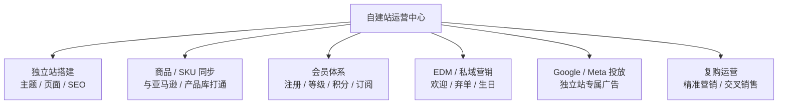

**核心价值**：
- 沉淀品牌私域资产，不受亚马逊平台规则变化影响
- 用户终身价值（LTV）是亚马逊一次性买家的 **3-5 倍**
- 通过 Brand Referral Bonus 反向导流回亚马逊，双渠道互利

**独立站与亚马逊的战略关系**：
- 亚马逊做**规模和转化**，独立站做**品牌和复购**
- 站外流量（红人/社媒）优先引到独立站沉淀用户，再通过 Attribution 导回亚马逊
- Brand Referral Bonus 奖励站外→亚马逊的导流，形成互利循环

---

### 4.7 洞察决策中心（对应 V3.0）

**定位**：将数据资产转化为业务决策，从"拍脑袋"到"数据驱动"。

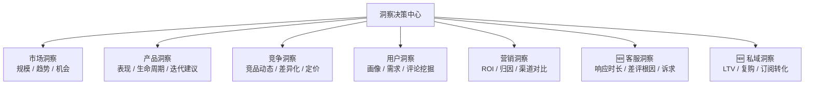

**核心价值**：让每个营销决策都有数据支撑，缩短"试错-调整"周期；覆盖亚马逊 + 独立站双渠道的全景洞察。

---

### 4.8 营销工具站（贯穿 V1-V3 🆕）

**定位**：嵌入到所有业务流程中的瑞士军刀式工具集合，解决七大业务中心覆盖不到的"细碎、高频、单点"提效需求。

> ⚠️ **与七大业务中心的本质区别**：业务中心是**端到端工作流**（完整业务能力闭环）；工具站是**碎片化提效工具**（单点功能、按需调用）。两者互补，不存在替代关系。

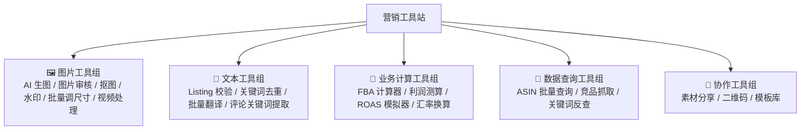

**典型工具示例**：

| 工具 | 解决的问题 | 使用频率 |
|------|----------|----------|
| **AI 生图** | 替代人工 P 图 / 第三方付费工具 | 每天 |
| **图片审核** | 上架前自动检查亚马逊主图合规（背景、占比、水印） | 每次上新 |
| **Listing 校验** | 字符数、敏感词、亚马逊禁用词扫描 | 每次上新/改版 |
| **FBA 计算器** | 输入尺寸重量 → 自动算 FBA 各项费用 | 选品 / 定价时 |
| **利润测算器** | 反推定价、模拟 ROI | 每次活动 |
| **ASIN 批量查询** | 一次性获取价格 / BSR / Review | 竞品监控 |
| **批量翻译** | 多站点 Listing 一键多语言 | 上新 |

**核心价值**：
- 解决"七大中心覆盖不到的细碎需求"，让每个角色每天少做 30 分钟重复劳动
- 替代部分付费第三方工具（H10、Jungle Scout 的部分功能），降低工具采购成本
- 工具是"显性提效"，员工最容易感受到价值，是推动系统使用习惯的"敲门砖"

**建设节奏**：不绑定单一版本，**采用"工具需求池 + 优先级评分"机制**，每 2 周迭代上线 1-2 个高频工具。

**早期重点**（建议优先做）：
1. 🖼 **图片审核**（违规风险高，差评高发）
2. 📝 **Listing 校验**（违规直接下架，损失大）
3. 🧮 **FBA 计算器**（选品 / 定价高频）
4. 🖼 **AI 生图**（替代付费工具，ROI 立竿见影）

---

## 五、七大中心 + 工具站 × 版本路线对齐

```mermaid
flowchart LR
    subgraph V1["V1.0 - 效率优先"]
        V1A["内容生产中心<br/>（核心）"]
        V1F["🧰 工具站 · 高频图片/文本"]
    end

    subgraph V2["V2.0 - 夯实基础 + 执行层"]
        V2A["数据资产中心<br/>（核心）"]
        V2B["营销执行中心<br/>（MVP）"]
        V2C["站外引流中心<br/>（MVP）"]
        V2D["智能客服中心<br/>（MVP）"]
        V2E["自建站运营中心<br/>（MVP）"]
        V2F["🧰 工具站 · 计算/数据查询"]
    end

    subgraph V3["V3.0 - 释放价值"]
        V3A["洞察决策中心<br/>（核心）"]
        V3B["营销执行 · 智能化"]
        V3C["站外引流 + GEO · 智能化"]
        V3D["智能客服 · AI Agent"]
        V3E["自建站 · 精准营销"]
        V3F["🧰 工具站 · AI Agent + 工作流编排"]
    end

    V1 --> V2 --> V3

    classDef core fill:#fef3c7,stroke:#f59e0b
    classDef tool fill:#fff7ed,stroke:#f97316
    class V1A,V2A,V2B,V2C,V2D,V2E,V3A,V3B,V3C,V3D,V3E core
    class V1F,V2F,V3F tool
```

**演进逻辑**：
- **V1 解决"内容怎么又快又好地产出"** → 内容生产中心
- **V2 解决"数据怎么管、执行怎么做、服务怎么跟、私域怎么沉淀"** → 数据资产 + 四个执行/服务中心的 MVP
- **V3 解决"怎么用数据指导决策、怎么让执行更聪明"** → 洞察决策中心 + 各中心智能化升级

> 💡 **V2 范围建议**：原 V2 规划中仅有"数据建设"，建议把营销执行、站外引流、**智能客服、自建站运营**四个中心的 MVP 都纳入 V2。核心理由：
> - **数据只有产生才有价值**：没有执行/服务/私域系统，数据资产中心是"空跑"
> - **客服是亚马逊运营的命门**：差评响应时长直接决定评分和排名
> - **独立站是品牌护城河**：越早开始沉淀私域用户，越早建立对平台的反脆弱能力

> 🧰 **关于营销工具站的特殊节奏**：工具站和七大业务中心不同，**没有"完整版本"概念**，而是**按业务紧急度持续添加单点工具**。建议建立"工具需求池 + 优先级评分"机制，每两周迭代上线 1-2 个高频工具。
> - **早期重点**：图片审核（差评高发）、Listing 校验（违规风险）、FBA 计算器（测算高频）、AI 生图（替代付费工具）
> - **价值定位**：工具是"显性提效"，员工最容易感受到价值，是推动系统使用习惯的"敲门砖"

---

## 六、角色 × 场景 × 中心 对照表

| 角色 | 主要业务场景 | 主要使用中心 |
|------|--------------|--------------|
| 选品经理 | 选品调研、产品迭代 | 数据资产中心、洞察决策中心 |
| Listing 运营 | Listing 搭建、日常运营、活动促销 | 内容生产中心、营销执行中心 |
| 广告投手 | 首发推广、日常运营 | 营销执行中心、洞察决策中心 |
| 站外 / 红人运营 | 首发推广、日常引流、GEO 运营 | 站外引流中心、内容生产中心 |
| 文案 / 美工 | Listing 搭建、内容产出 | 内容生产中心、数据资产中心（素材库） |
| 客服 | 买家消息、评论管理、差评响应 | **智能客服中心**、内容生产中心（FAQ）、数据资产中心（评论库） |
| 🆕 独立站运营 | 独立站搭建、私域运营、复购营销 | **自建站运营中心**、站外引流中心、内容生产中心 |
| 数据分析师 | 数据复盘、效果归因 | 洞察决策中心 |
| 主管 / 总监 | 决策、复盘、资源分配 | 洞察决策中心（管理驾驶舱） |

---

## 七、下一步建议

1. **对齐共识**：本文档作为全员宣讲材料，先在产品/运营核心团队小范围 review，确认业务中心划分无遗漏
2. **细化 V2 范围**：就"是否把营销执行中心、站外引流中心最小版本纳入 V2"与管理层对齐
3. **排期优先级**：在每个中心内部，按"核心业务场景使用频率"排优先级（例如广告投放比 DSP 更优先）
4. **产出配套物料**：本框架图可进一步产出 HTML 可视化版本，作为对外演示材料

---

## 附录：关键术语

| 术语 | 说明 |
|------|------|
| SP / SB / SD | 亚马逊站内三种广告类型（商品推广 / 品牌推广 / 展示型推广） |
| DSP | Amazon Demand-Side Platform，程序化广告平台 |
| A+ | Listing 详情页的增强内容模块 |
| LD / BD | Lightning Deal / Best Deal，亚马逊秒杀活动 |
| BRB (Brand Referral Bonus) | 亚马逊站外引流返利计划 |
| Attribution | 亚马逊官方的站外流量归因工具 |
| SP-API | 亚马逊卖家平台 API |
| **GEO** 🆕 | **Generative Engine Optimization**，生成式引擎优化。针对 ChatGPT / Perplexity / Google AI Overview 等 AI 搜索引擎的内容优化，目标是让品牌/产品被 AI 引用为答案 |
| AIO 🆕 | **AI Overview**，Google 搜索结果页顶部由 AI 生成的答案摘要 |
| **LTV** 🆕 | **Life-Time Value**，用户终身价值。独立站比亚马逊更容易沉淀高 LTV 用户 |
| DTC 🆕 | **Direct-to-Consumer**，品牌直接面向消费者（独立站的核心业务模型） |
| Shopify / Shoplazza 🆕 | 主流独立站建站平台（国外 / 国内服务商） |
